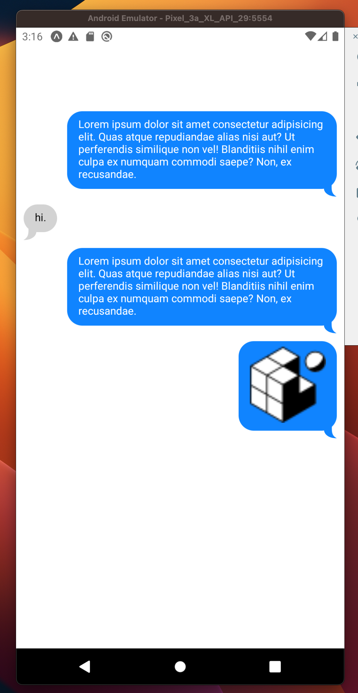
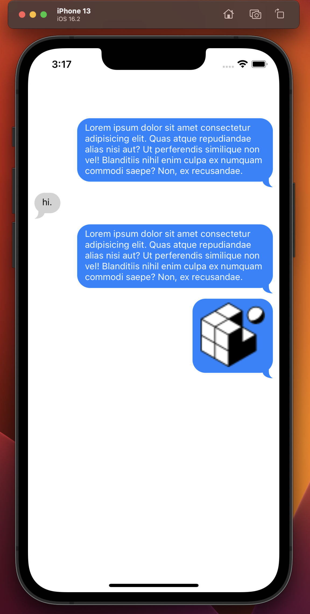

# React Native Chat Bubble

<div>
  
  
</div>

React Native Chat bubble is a simple lightweight component for your React Native Applications which uses [react-native-svg](https://www.npmjs.com/package/react-native-svg) and [react-native-size-matters](https://www.npmjs.com/package/react-native-size-matters) to create a highly customizable chat bubble for you with curved tail or without.

This is a dynamic HOC 

## Installation

Install the package using npm or yarn:

```bash
npm install react-native-chat-bubble react-native-svg react-native-size-matters
yarn add react-native-chat-bubble react-native-svg react-native-size-matters

```
If you're using Expo, make sure to use the expo install command to install these packages to ensure compatibility with your Expo SDK version:

```bash
expo install react-native-chat-bubble
expo install react-native-svg
expo install react-native-size-matters

```
# Usage 

```jsx

import ChatBubble from 'react-native-chat-bubble';

<ChatBubble
  isOwnMessage={true}
  bubbleColor='#1084ff'
  tailColor='#1084ff'
  withTail={true}
  onPress={() => console.log("Bubble Pressed!")}
>
  <Text>Your message content</Text>
</ChatBubble>

```
Check the [example](#example)

## Props

The SwipeableFlatList component accepts the following props:

### ViewProps: 

If you don't pass onPress function, the chat bubble wrapper will be a View from react-native and you can also pass the rest of the ViewProps, which you can check [here](https://github.com/facebook/react-native-website/blob/main/website/versioned_docs/version-0.71/view.md)

### PressableProps

If you pass the onPress function, the package will wrap the ChatBubble in Pressable from react-native to call your function when the user presses the message, so you can also pass the rest of the PressableProps, which you can check [here](https://github.com/facebook/react-native-website/blob/main/docs/pressable.md)

### isOwnMessage: `boolean`

Prop to identify the message and therefore the alignment.

### children: `ReactNode`

The message content.

## bubbleColor: `string`
Color of your chat bubble. Defaults to #1084ff for own messages and grey for others.

## tailColor: `string`
Color of the tail of the chat bubble. If you pass a bubbleColor prop and your tail and the bubble are the same color, you don't need to use this prop, they'll match automatically.

## withTail: `boolean`
Prop which defines if the tail is displayed with your message. Defaults to `true`.

## withTail: `boolean`
Prop which defines if the tail is displayed with your message. Defaults to `true`.

## hitSlop:` ({top: number, bottom: number, left: number, right: number})`
increase the touchable area of the chat bubble.

## maxWidth:`number`
Maximum width of your chat bubble. When adjusting maxWidth this prop should be used instead of a style override, in order to use `moderateScale`. Defaults to `250`

## style: `StyleProp<ViewStyle>`
Additional styles or style overrides for the chat bubble.

## License
This project is licensed under the [MIT License](https://opensource.org/license/mit/).


## Dependencies

- [react-native-svg](https://www.npmjs.com/package/react-native-svg)
- [react-size-matters](https://www.npmjs.com/package/react-native-size-matters)


`react-native-chat-bubble` has a peer dependency on `react-native-svg` and `react-native-size-matters`. It will be installed automatically when you install this package. However, please ensure that your project meets the requirements for both of these libraries.


### example 

```jsx

import React from 'react';
import { Alert, Image, StyleSheet, Text, View } from 'react-native';
import ChatBubble from "react-native-chat-bubble";

const App: React.FC = () => {

  return (
    <View style={styles.container}>
      <ChatBubble
        isOwnMessage={true}
        bubbleColor="#1084ff"
        tailColor="#1084ff"
        withTail={true}
        style={styles.chatBubble}
      >
        <Text style={styles.textOwn}>Lorem ipsum dolor sit amet consectetur adipisicing elit. Quas atque repudiandae alias nisi aut? Ut perferendis similique non vel! Blanditiis nihil enim culpa ex numquam commodi saepe? Non, ex recusandae.</Text>
      </ChatBubble>
      <ChatBubble
       onPress={() => Alert.alert("Hi", "This is alert")}
        isOwnMessage={false}
        bubbleColor="lightgrey"
        withTail={true}
        style={styles.chatBubble}
      >
        <Text style={styles.text}>hi.</Text>
      </ChatBubble>
      <ChatBubble
        isOwnMessage={true}
        bubbleColor="#1084ff"
        tailColor="#1084ff"
        withTail={true}
        style={styles.chatBubble}
      >
        <Text  style={styles.textOwn}>Lorem ipsum dolor sit amet consectetur adipisicing elit. Quas atque repudiandae alias nisi aut? Ut perferendis similique non vel! Blanditiis nihil enim culpa ex numquam commodi saepe? Non, ex recusandae.</Text>
      </ChatBubble>
      <ChatBubble
        isOwnMessage={true}
        bubbleColor="#1084ff"
        tailColor="#1084ff"
        withTail={true}
        style={styles.chatBubble}
      >
        <Image style={{height:100, width:100}} 
        resizeMode="contain" 
        resizeMethod="resize"  
        source={{uri: "https://raw.githubusercontent.com/GFean/rn-gesture-swipeable-flatlist-example/main/assets/favicon.png"}}/>
      </ChatBubble>
    </View>
  );
};

const styles = StyleSheet.create({
  container: {
   marginTop:100,
    flex: 1,
   paddingHorizontal:10
  },
  chatBubble: {
    padding: 10,
  },
  text: {
    color: 'black',
  },
  textOwn: {
   color: 'white',
 },
});

export default App

```